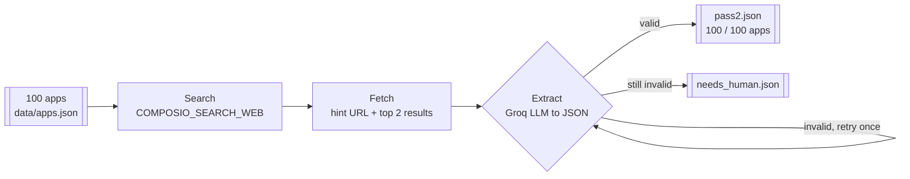
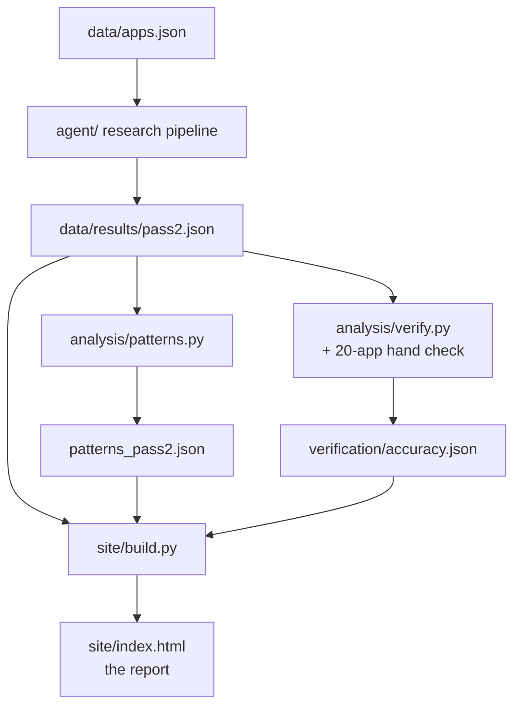

# The Buildability Ledger

A take-home for Composio's AI Product Ops Intern role. It asks one question about 100
apps: could an AI agent use each one today, and if not, what is stopping it.

**Report:** https://composio-app-research-cfcmadlad.vercel.app/
**Repo:** https://github.com/cfcmadlad/composio-app-research

Prepared by Aditya Rayaprolu ([@cfcmadlad](https://github.com/cfcmadlad)).

## What's here

- `data/apps.json` holds the 100 apps, transcribed from the assignment.
- `agent/` is the Python pipeline that researches each app for real, using Composio's own tools.
- `analysis/` turns the results into patterns and scores the verification checks.
- `site/` builds the report page above from the real data. No number on it was typed by hand.
- `data/results/` and `data/verification/` hold everything the agent and the verification loop actually produced.

## How the research agent works

For each app, three Composio tools do the work. Nothing is looked up by hand.



Search finds the docs. Fetch pulls the real page text. An LLM reads that text and answers
the assignment's four questions, with an evidence link for each one. If the model's JSON
does not parse, it gets one corrected retry before the app is set aside for a person. In
the final run, every app produced a valid result. One needed a second try.

## How the whole project fits together



`build.py` computes every number on the report page from these JSON files at build time.
None of it is typed by hand.

## Running it yourself

```bash
# 1. Get a free Composio key at dashboard.composio.dev (Settings -> API Keys)
echo "COMPOSIO_API_KEY=your_key_here" > .env

# 2. Install dependencies
python -m pip install -r agent/requirements.txt

# 3. Run the research agent across all 100 apps
python -m agent.run --pass 2

# 4. Turn the results into patterns
python analysis/patterns.py --pass 2

# 5. Score the verification sample, after filling in ground truth by hand
python analysis/verify.py --generate-template
python analysis/verify.py

# 6. Build the report page
python site/build.py
```

To confirm the key works first, run `python -m agent.run --check`. It makes a single test
call. `python -m agent.run --limit 5` runs a quick dry run on five apps.

On Windows, if step 2 throws an SSL error, run `python -m pip install pip-system-certs`
first. It makes Python trust the operating system's certificate store instead of only its
own bundled list.

## The results, briefly

- **91 of 100 apps are self-serve.** A developer can get working credentials without
  talking to anyone.
- **OAuth2** is the most common auth method, used by 61 apps. MCP servers already exist
  for 32.
- The verification sample was 20 apps and 80 checks against real docs, chosen before any
  result was read. Accuracy was **88.8% on the first pass, 96.2% after fixing what it found.**

The full breakdown, the patterns, and the honest misses (including one that survived both
passes) are on the report page. That is the actual deliverable. This README is the map.

## What went wrong, kept in rather than cleaned up

Six real problems came up while building this: a decommissioned model, a misread acronym,
a search that missed its own hint, two name collisions that pulled in the wrong product, a
results file overwritten by a bug in this code, and one extraction that failed once before
succeeding. Each one is described with evidence in the report page's "What Was Built" section.
